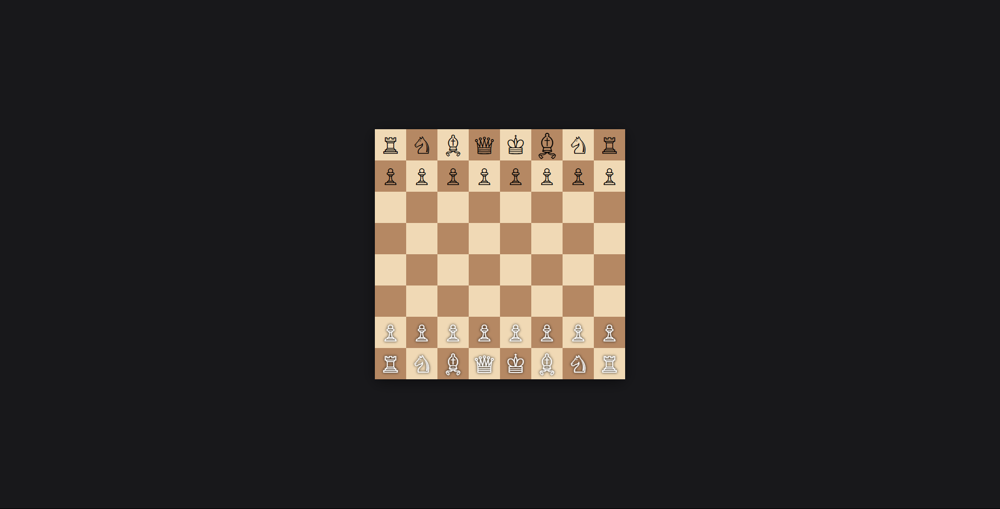

# Chess Game

This is a real-time multiplayer chess game built using Node.js, Socket.IO, and the Chess.js library. The game allows two players to play chess in real-time, while additional users can join as spectators.

## Features

- Real-time multiplayer chess.
- Drag-and-drop functionality for moving pieces.
- Automatic board flipping for black player.
- Spectator mode for additional users.
- Highlights invalid moves.

## Technologies Used

- **Backend**: Node.js, Express.js, Socket.IO
- **Frontend**: HTML, CSS (TailwindCSS), JavaScript
- **Chess Logic**: Chess.js

## Installation

1. Clone the repository:
   ```bash
   git clone https://github.com/your-repo/chess-game.git
   cd chess-game
   ```

2. Install dependencies:
   ```bash
   npm install
   ```

3. Start the server:
   ```bash
   npm start
   ```

4. Open your browser and navigate to:
   ```
   http://localhost:3000
   ```

## How to Play

1. Open the game in two different browser tabs or share the link with a friend.
2. The first user to connect will play as white, and the second user will play as black.
3. Additional users will join as spectators.
4. Drag and drop pieces to make moves. Invalid moves will be highlighted.

## Chessboard View

Below is a preview of the chessboard:



## File Structure

```
chess/
├── app.js                # Server-side logic
├── package.json          # Project dependencies
├── public/               # Static files
│   ├── css/              # Stylesheets
│   └── js/               # Client-side JavaScript
│       └── chessgame.js  # Chessboard rendering and game logic
├── views/                # EJS templates
│   └── index.ejs         # Main HTML template
└── README.md             # Project documentation
```

## License

This project is licensed under the MIT License. See the LICENSE file for details.
